# SparkRun screenshot tour

These captures come from the real Chrome validation session, not a static UI
mock. They show the outer SparkRun workbench, the CheerpX Linux guest, Gemini
Interactions activity, Browser Vault recovery, and the Tailnet-served app at
different points in the same release investigation. Credential fields are
masked; no key values or `.env` contents are included.

## 1. Configure the browser workspace

The setup screen keeps the project identity, fixed Gemini 3.7 Flash model, and
the two browser-held connections legible without putting recovery controls in
the main path.

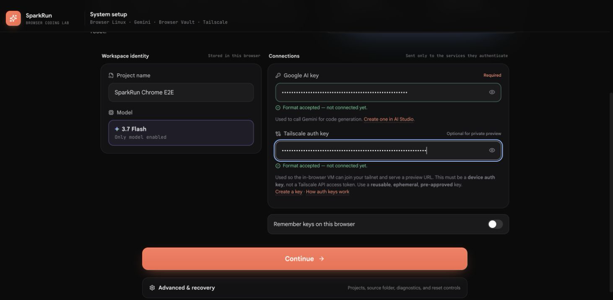

## 2. Start from a quiet coding surface

The rebuilt workbench uses a project/conversation rail, one continuous coding
stream, a compact composer with the model selector, and a collapsible
Environment inspector. Preview, Files, Terminal, and Activity are available
without dominating the initial view.

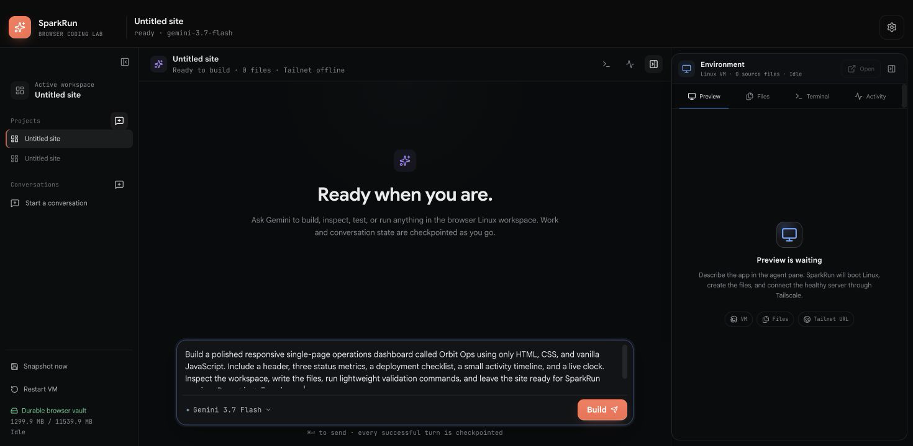

## 3. Boot a real Linux guest in Chrome

After Build, the conversation stays readable while the CheerpX VM boots. The
right panel reports the real VM/files/Tailnet readiness rather than showing an
optimistic preview placeholder.

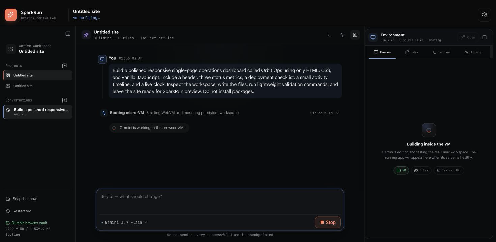

## 4. Make retry behavior visible

Transient Gemini transport failures are presented as compact milestones. The
harness owns the retry count and disables SDK retries, so `attempt 2/9` means
one initial request plus the first of exactly eight permitted retries.
This and the next capture are investigation-era images from a dirty working
tree (`+dirty` in Diagnostics), not evidence of the final deploy SHA.

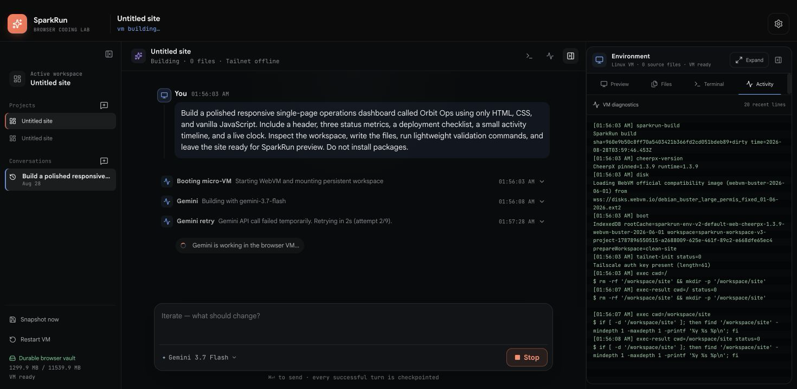

## 5. Watch the agent use the VM

The center stream shows concise Inspect, Shell, and Edit activity. Expanding
Activity exposes the underlying CheerpX diagnostics, pinned runtime, mounted
workspace, and executed commands when low-level evidence is needed.

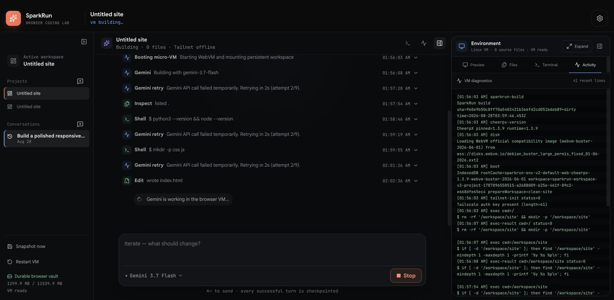

## 6. Stop without losing the workspace

Stop aborts the provider request and disposes the VM process boundary. The next
message can resume from Browser Vault instead of pretending a cancelled process
is still safe to use.

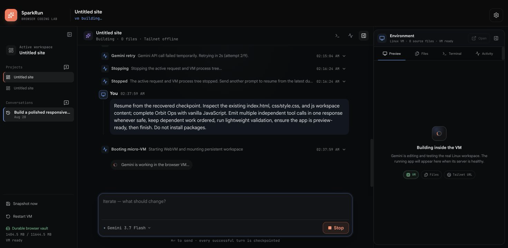

## 7. Restore the durable checkpoint

The resumed conversation boots a fresh guest and restores the last verified
workspace archive. Project files and conversation context survive; guest RAM
and live processes intentionally do not.

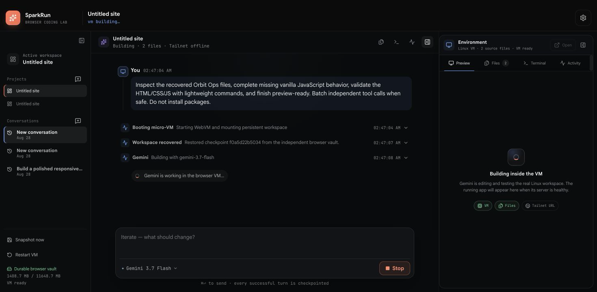

## 8. Batch independent tools, preserve dependencies

Gemini may emit independent calls together, which SparkRun executes in order
and returns as one continuation. Dependent work still waits for the prior
result, preventing speculative edits against stale state.

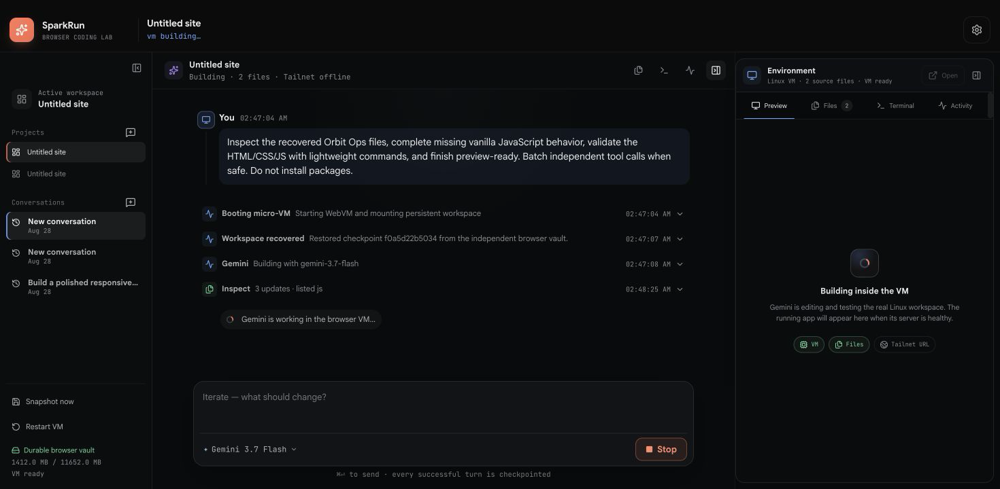

## 9. Persist long high-thinking turns

Gemini 3.7 Flash runs high-thinking requests as background Interactions.
SparkRun persists the Interaction ID and polls it instead of recreating the
same expensive turn after a short foreground timeout.

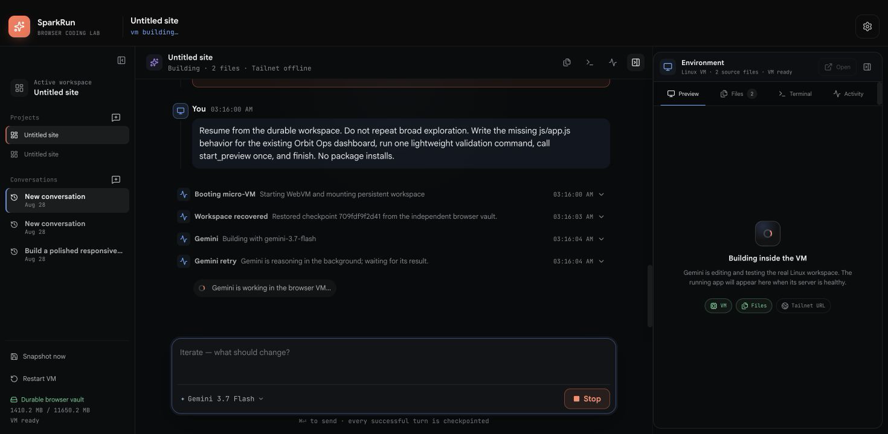

## 10. Diagnose provider execution pressure

This investigation capture records request retries and the earlier nested
background-execution recovery behavior after Google returned explicit
high-demand failures. The bug bash showed that combining those layers could
multiply provider work, so the release implementation keeps exactly eight
transport retries per `create`, `get`, or `cancel` operation and does not replay
a terminally failed background execution.

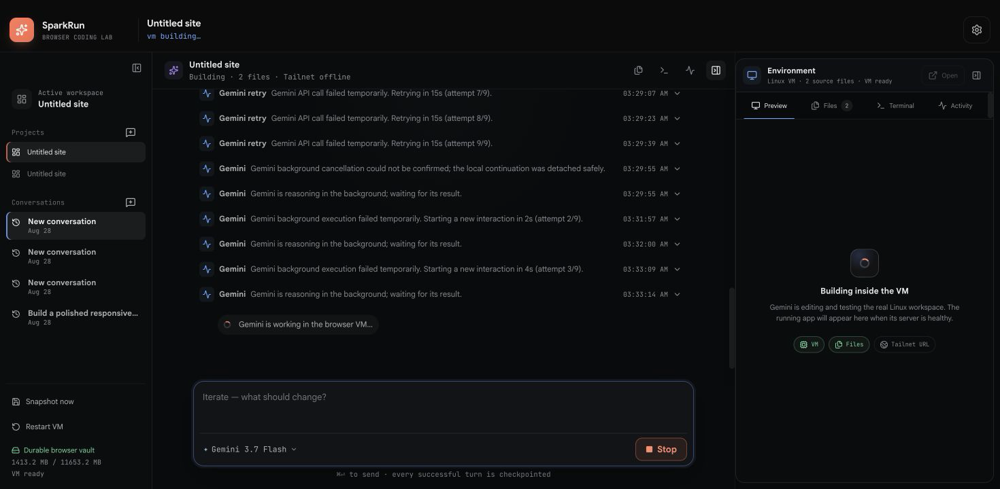

## 11. Reach the generated app through the tailnet

Outer Chrome loaded the page from the VM's `100.x.x.x` Tailscale address. The
guest server log independently recorded the browser's asset requests, proving a
real HTTP connection rather than only a bound port or an in-app status flag.

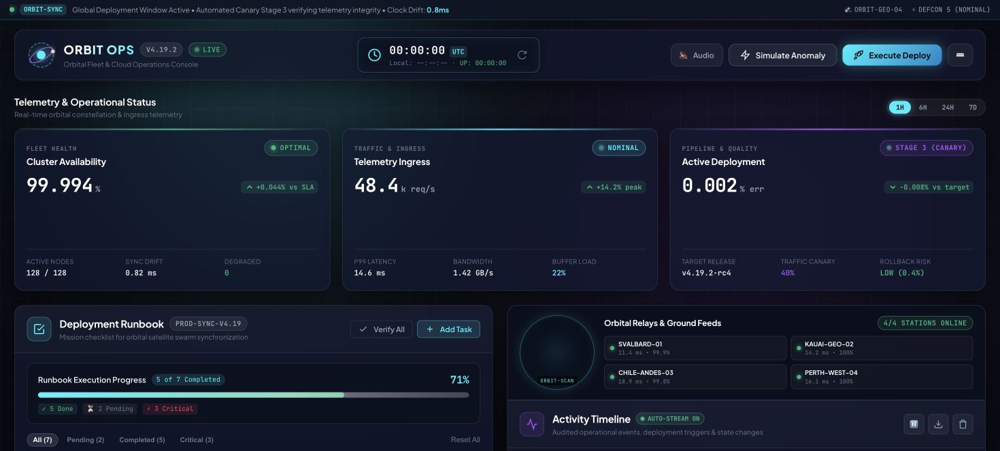

## 12. Interact with the running result

The live dashboard responded to its controls in the separate Chrome tab. This
is the generated application boundary, outside the SparkRun React tree.

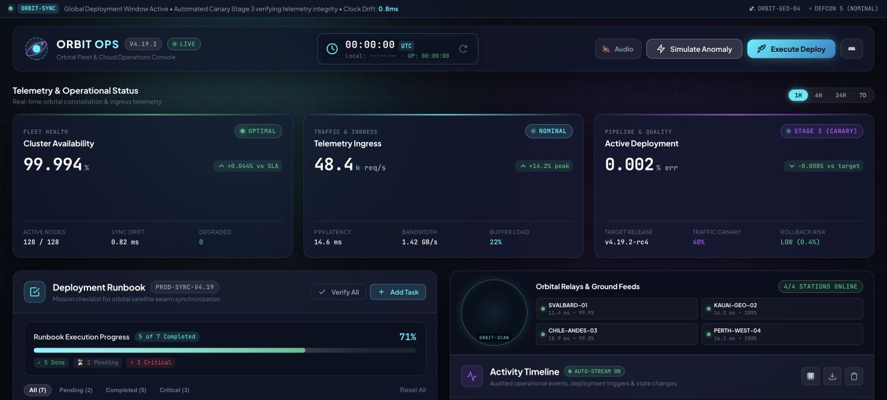

## 13. Turn a live defect into a narrow coding follow-up

The server log exposed a missing `/js/app.js` request. SparkRun resumed the
workspace and issued a file-scoped repair through the same conversation. This
capture documents the investigation stage; the final release evidence must
still show the repaired file and a 200 response. It also predates the final UI
fix that hides nonfatal Tailnet retry while a coding run is active; the visible
Retry control is historical, not the shipped state.

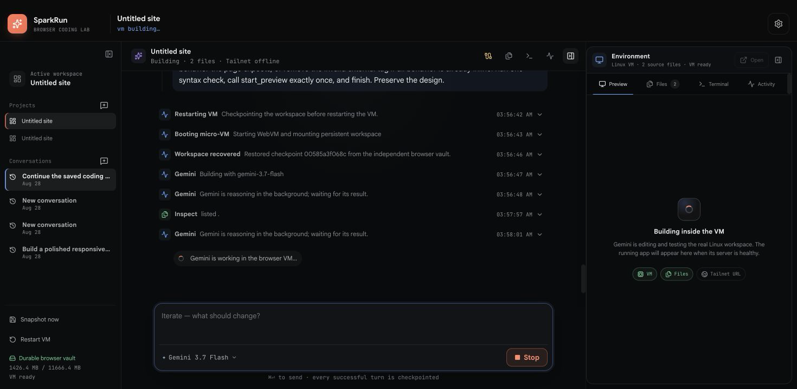

## 14. Repair and verify the missing asset in the VM terminal

The targeted provider turn remained stuck under sustained service pressure, so
the same workspace was repaired through its real Linux terminal. The terminal
proof shows `js/app.js` present and Node parsing it successfully; a Browser
Vault checkpoint was then committed and restored into a new VM. This proves the
file repair and persistence boundary, but not yet the final outer-Chrome HTTP
200—that evidence was captured again later in the checkpoint run.

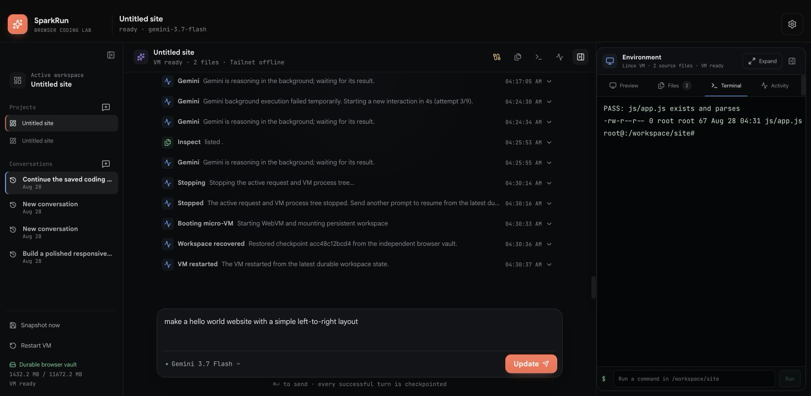

## 15. See the rebuilt workbench with durable history

This investigation capture shows the compact project/conversation rail, the
continuous chat and activity stream, the model selector in the composer, and
the collapsible Environment inspector after a Browser Vault recovery. It is a
historical dirty-tree capture, not a final-commit screenshot.

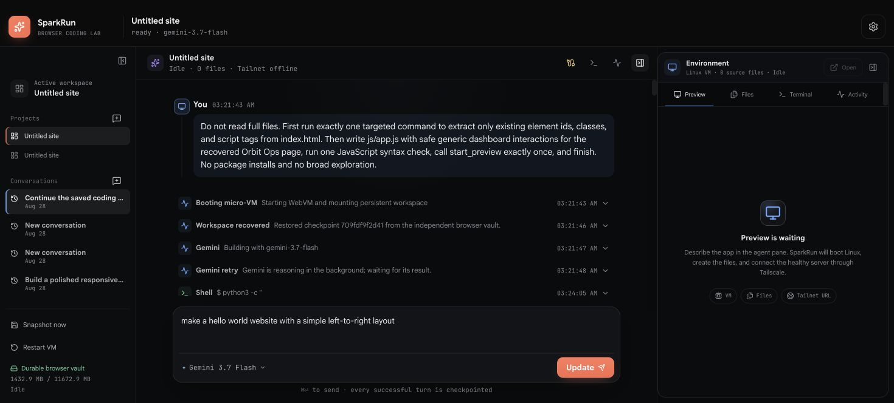

## 16. Start a clean project without UI noise

The fresh-workspace state keeps the primary action obvious while Files,
Terminal, Activity, project history, and environment details remain one click
away.

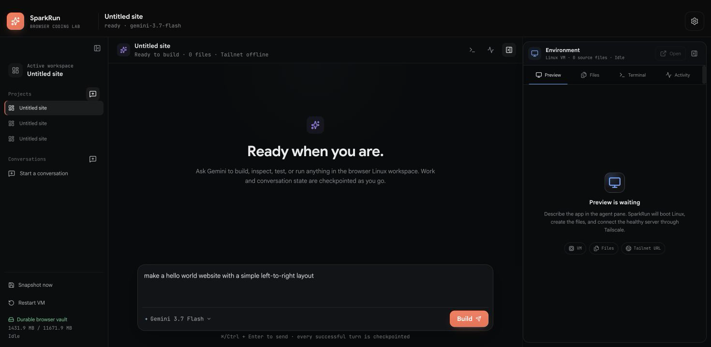

## 17. Fail honestly when the live provider stalls

On August 28, 2026, Google accepted a Gemini 3.7 Flash background Interaction
but did not return a terminal result within SparkRun's 12-minute turn budget.
SparkRun timed out the turn, attempted cancellation, checkpointed the workspace,
and returned the VM to an operable state. A separate SDK probe then received
explicit provider `500` high-demand errors. This image is evidence of recovery,
not a successful coding turn.

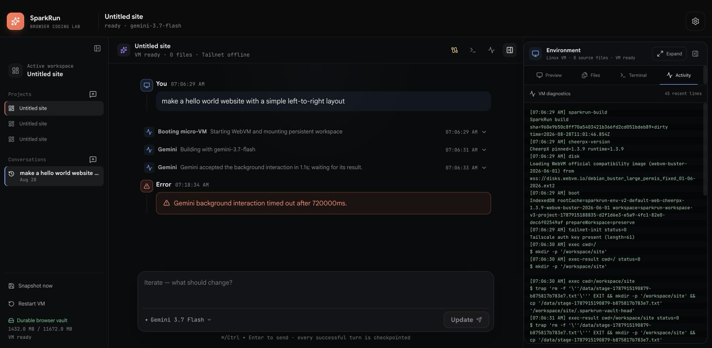

## 18. Use the real root terminal independently of the model

Even while the model service was degraded, the CheerpX guest remained usable.
The terminal reports the i386 CheerpX kernel ABI, Python 3.7.3, guest root, and
a file written directly under `/workspace/site`.

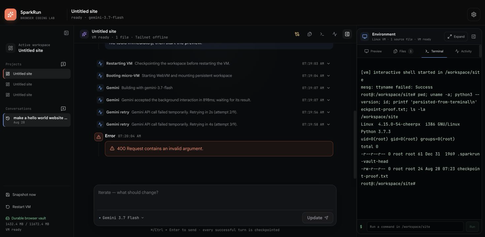

## 19. Keep that terminal-created file through a VM restart

Snapshot now committed a Browser Vault recovery point. After Restart VM, a new
guest attached to the matching preserved workspace cache, read the exact file
content, and reported its byte count and mode. This proves file survival through
restart; it does not claim the archive was extracted during this restart.

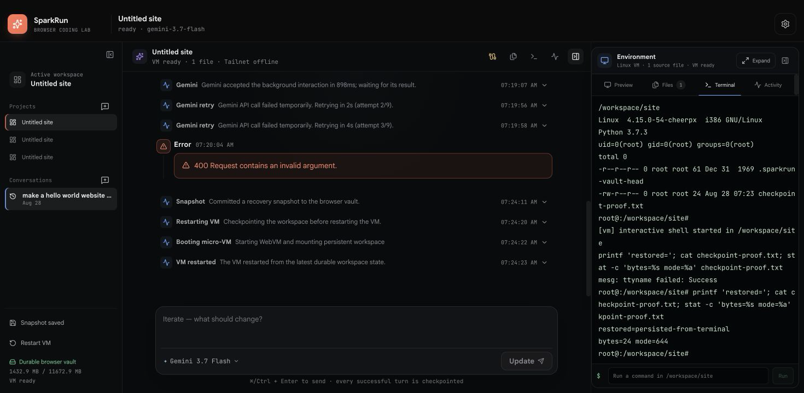

## 20. Load the VM server from a separate Chrome tab

The saved Tailscale auth key enrolled the browser VM, the supervised Python
server bound port 8081, and a second Chrome tab rendered this page at the VM's
private `100.x.x.x` address.

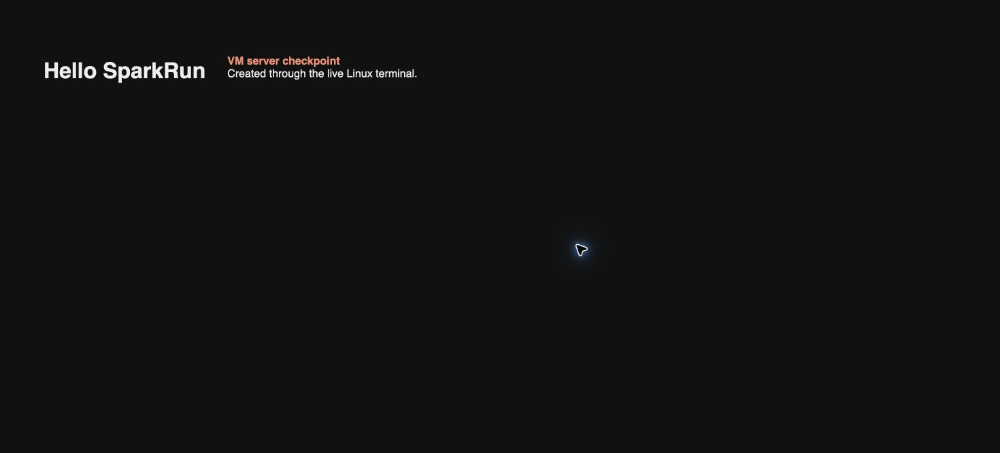

## 21. Prove the outer-browser request reached the guest

The workbench shows Tailnet and bind/PID readiness while the terminal tails the
guest server log. `GET / HTTP/1.1` returned `200`, independently proving that
outer Chrome reached the VM rather than merely displaying a URL. This capture
predates the final copy change from “Site is live” to the more precise “Server
is ready at”; the application now asks the user to open the URL for this proof.

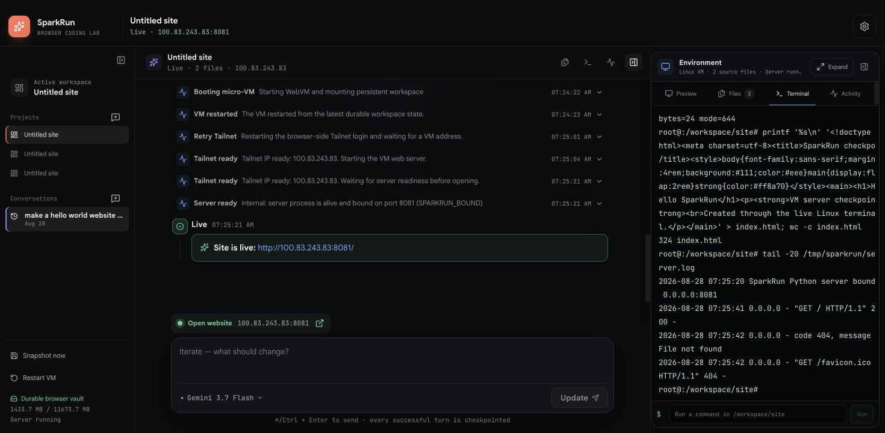

## What the images do and do not prove

Together the captures prove that the main UI, VM boot, model/tool activity,
checkpoint restore, provider retry visibility, private server route, terminal,
and live app interaction were exercised in Chrome across the investigation.
The August 28 checkpoint specifically proves VM boot, terminal use,
snapshot/restart persistence, Tailscale enrollment, server readiness, and an
outer-Chrome `200`; it does **not** prove a successful current Gemini coding
turn. The app's terminal 400 remains unexplained; a separate direct SDK probe
independently observed provider high demand. The captures also do not replace the
automated suite, source review, release-manifest verification, or a fresh
deployed-origin smoke. Those gates are defined in [TESTING.md](TESTING.md).
